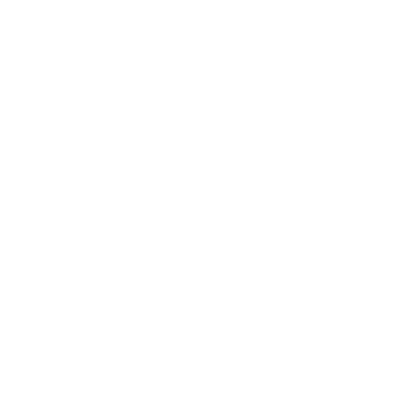
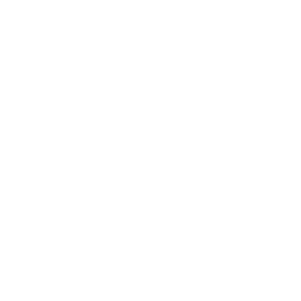
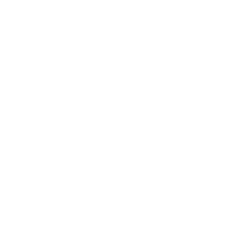
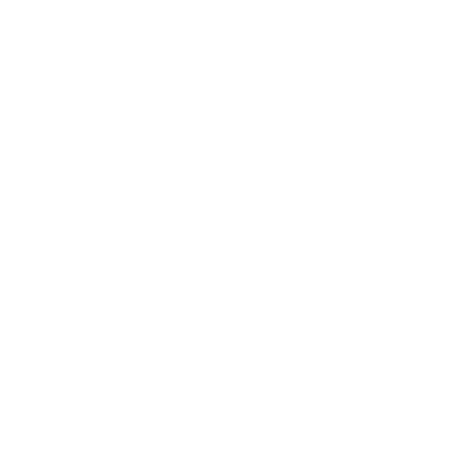
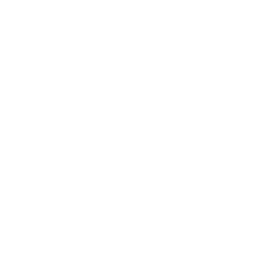

<!-- Terminal Typing Animation -->

  

### `keep learning`  •  `keep building`  •  `keep breaking`
*Understand the system. Map the surface. Automate the repetitive. Validate the finding.*

 

##  `whoami`

I am a developer focused on cybersecurity, with a keen interest in web app security, bug bounties, and vulnerability research.

My software engineering and web development background gives me hands-on knowledge of how modern applications are created and, more importantly, how they fail. I employ that knowledge to examine applications from an attacker's perspective in order to find flaws, confirm vulnerabilities, and discover the reasons for their emergence.

My current activities include web security, reconnaissance, attack surface mapping, vulnerability verification, and security automation. I am improving my skills through experimentation, creation of security tools, and testing real applications.

I believe that good security research is more than just vulnerability detection; it means understanding how vulnerabilities appear, how they can be exploited, their implications, and their solutions.

In the process of learning. Constantly experimenting. Always inquiring.

 

> **Learn** ➔ **Build** ➔  **Test** ➔  **Break** ➔  **Analyze** ➔  **Improve**

 

##  `focus areas`

<table>
  <tr>
    <td width="50%" valign="top">
      <h3>🛡️ Security Research</h3>
      <ul>
        <li>Web Application & API Security</li>
        <li>Attack Surface Discovery & OSINT</li>
        <li>Bug Bounty & Vulnerability Research</li>
        <li>Reconnaissance</li>
      </ul>
    </td>
    <td width="50%" valign="top">
      <h3>🛠️ Security Engineering</h3>
      <ul>
        <li>Recon Automation & Payload Generation</li>
        <li>Security-focused Tool Development</li>
        <li>API-driven Tooling</li>
        <li>Security Research Workflows</li>
      </ul>
    </td>
  </tr>
</table>

##  `Skills`

###  Programming & Scripting

  

###  Offensive Security & Reconnaissance

  
  
  
  
  
  
  
  

###  Infrastructure & Web Technologies

  

---

   
  <i>Stay stealthy, stay curious.</i>

